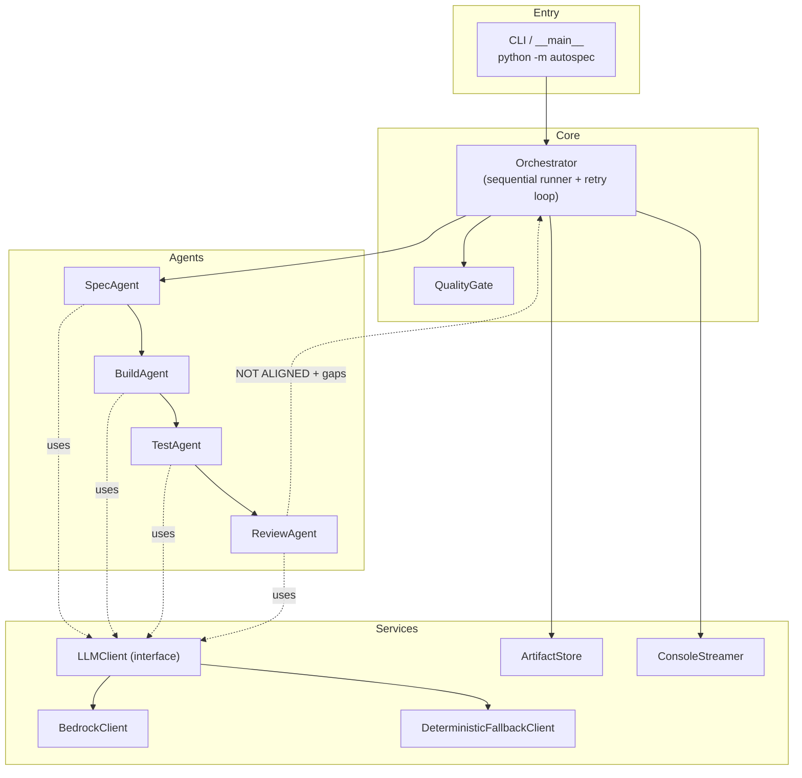
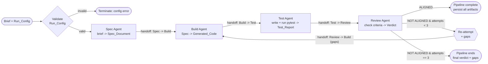
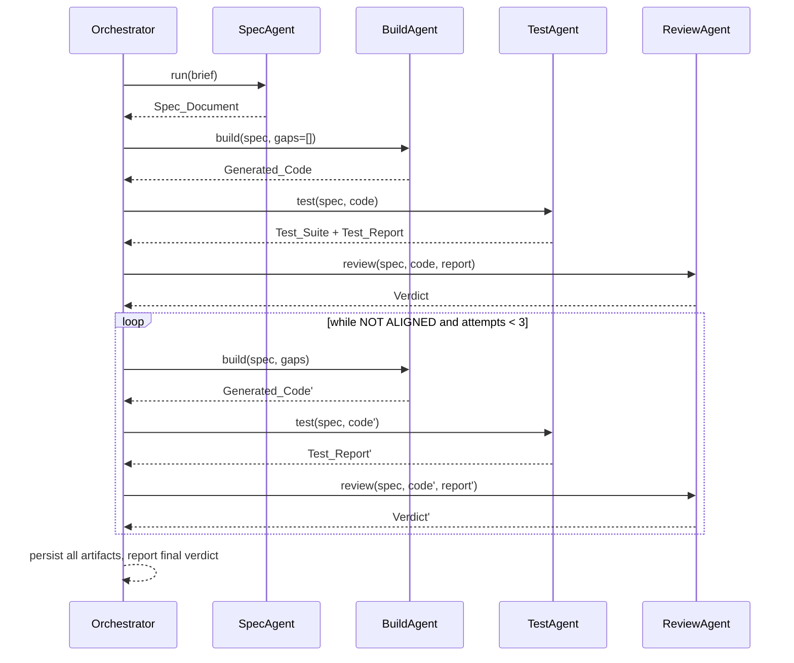

# Design Document: AutoSpec Multi-Agent Pipeline

## Overview

AutoSpec is a Python orchestration pipeline that turns a single plain-English brief into a complete, demonstrable software deliverable: a structured spec, working Python code, a passing pytest suite with coverage, and a spec-to-code alignment verdict. It is built for a non-technical product manager who writes a 2-3 sentence brief and walks away with documented, tested, runnable code the same day.

The system coordinates four specialised agents that run in sequence and hand their outputs to one another:

1. **Spec Agent** — brief → `Spec_Document` (numbered requirements, Given/When/Then acceptance criteria, edge-case list). Writes no code.
2. **Build Agent** — `Spec_Document` → `Generated_Code` (a single pure-function Python module, no DB/network/file-IO/web-server, docstrings on public functions).
3. **Test Agent** — `Spec_Document` + `Generated_Code` → `Test_Suite` (one pytest test per acceptance criterion) → runs it → `Test_Report` (passed, failed, coverage %).
4. **Review Agent** — checks every acceptance criterion → `Alignment_Verdict` ("ALIGNED" / "NOT ALIGNED" + explicit `Gaps`).

The defining innovation is a **self-correcting Review → Build retry loop**: when the verdict is NOT ALIGNED and re-attempts remain (limit 3), the pipeline feeds the gaps back to the Build Agent and re-runs Build → Test → Review automatically. Every handoff is streamed to the console so the relay is visible live, and every artifact is persisted to an `Artifact_Directory`.

### Design Goals (mapped to hackathon judging)

- **Working demo (30%)**: A single command (`python -m autospec`) runs the canonical tip-calculator brief end to end. A **deterministic fallback** guarantees the demo never fails even with no network or no Bedrock credentials.
- **Innovation (20%)**: The self-correcting retry loop and live-streamed agent handoffs are the centerpiece; agents are LLM-backed via AWS Bedrock with a pluggable client.
- **Spec quality (25%)**: Requirements are already approved; this design traces every component back to R1–R13.
- **Pitch & storytelling (25%)**: The agent handoff diagram and orchestration narrative below are written to drive a 3-minute pitch.

### Requirements Coverage Map

| Requirement | Design element |
|---|---|
| R1 Single-input trigger | `Orchestrator.run()` sequential stage runner |
| R2 Run config validation | `RunConfig.validate()` + pre-flight gate |
| R3 Spec Agent | `SpecAgent` + `SpecDocument` model |
| R4 Build implements to spec | `BuildAgent` + requirement→code traceability check |
| R5 Test Agent | `TestAgent` + pytest runner + timeouts |
| R6 Review verdict | `ReviewAgent` + per-criterion met/unmet logic |
| R7 Self-correcting retry | `Orchestrator` retry loop (limit 3) |
| R8 Observable handoffs | `ConsoleStreamer` / `HandoffReporter` |
| R9 Artifact persistence | `ArtifactStore` |
| R10 Quality gate | `QualityGate.evaluate()` |
| R11 Code constraints | `BuildAgent` + `ConstraintChecker` |
| R12 Demo brief | `demo.DEMO_BRIEF` + `DEFAULT_RUN_CONFIG` |
| R13 Tip-calculator behaviour | Generated demo code + deterministic fallback template |

## Architecture

AutoSpec is a layered, single-process Python application. The orchestrator owns control flow; agents are stateless transformers; cross-cutting services (LLM client, persistence, streaming) are injected so the system stays testable and the demo stays resilient.



### Agent Handoff Diagram

This is the core visual for the pitch. It shows the linear relay and the self-correcting loop.



### Orchestration Narrative (3-minute pitch script)

> "Meet Priya, a product manager. She types three sentences: *'I want a tip calculator. Users enter a bill, a tip percentage, and how many people. It returns the tip, the total, and the per-person split.'* She hits run.
>
> **The Spec Agent** reads her brief and writes a real spec — numbered requirements, Given/When/Then acceptance criteria, and edge cases she didn't think of, like zero-tip and invalid party sizes. It writes zero code.
>
> It hands that spec to **the Build Agent**, which writes a single clean Python module — pure functions, documented, no databases, no surprises.
>
> The code flows to **the Test Agent**, which writes one pytest test for every acceptance criterion, runs them, and reports pass/fail counts and coverage.
>
> Finally **the Review Agent** audits the result against the original spec. If anything is missing, it doesn't give up — it writes down the exact gaps and **hands the work back to the Build Agent to try again**, up to three times. That's the self-correcting loop.
>
> Every handoff streams to the screen live, so you watch four AI agents relay work to each other. Minutes later, Priya has a spec, working code, a green test suite at 90%+ coverage, and a verdict that says ALIGNED — all on disk, ready to demo."

### Control Flow (retry loop)

The orchestrator implements R1 (sequence) and R7 (bounded self-correction). Re-attempts re-run **Build → Test → Review only** (the spec is fixed after the first stage).



## Components and Interfaces

All agents share a common shape: a single public method that takes typed inputs and returns a typed result, raising a typed `AgentError` on failure. Agents never persist or stream directly — the orchestrator owns side effects (keeps agents pure-ish and testable).

### Orchestrator

Owns the run lifecycle, sequencing, retry loop, persistence triggers, and streaming triggers.

```python
class Orchestrator:
    def __init__(self, spec_agent, build_agent, test_agent, review_agent,
                 store: ArtifactStore, streamer: ConsoleStreamer,
                 quality_gate: QualityGate, retry_limit: int = 3): ...

    def run(self, brief: Brief | None, config: RunConfig | None) -> PipelineResult:
        """Execute the full pipeline. Validates inputs (R1.4, R1.5, R2),
        runs Spec->Build->Test->Review (R1.1), applies the retry loop (R7),
        streams handoffs (R8), and persists artifacts (R9). Never requires
        human input mid-run (R1.2)."""
```

Responsibilities: input presence checks (R1.4/R1.5), config validation gate (R2), sequential execution (R1.1), stop-on-failure with artifact retention (R1.6), retry loop (R7), final status (R1.3).

### SpecAgent (R3)

```python
class SpecAgent:
    def run(self, brief: Brief) -> SpecDocument:
        """Convert a brief into a Spec_Document with >=1 sequentially
        numbered requirement, each with >=1 Given/When/Then criterion,
        plus a non-empty edge-case list. Produces no source code.
        Raises AgentError if the brief is empty/non-actionable (R3.5)."""
```

### BuildAgent (R4, R11)

```python
class BuildAgent:
    def run(self, spec: SpecDocument, gaps: list[Gap] = ()) -> GeneratedCode:
        """Generate a single Python module implementing exactly the spec.
        Every requirement maps to >=1 code element (R4.2); no untraceable
        functionality (R4.4). Enforces constraints (R11): single file, pure
        functions, no DB/network/file-IO/web-server, docstrings on public
        functions. On re-attempts, addresses the supplied gaps (R7.1).
        Raises AgentError if the spec has 0 requirements / is unparseable (R4.5)."""
```

Internally uses a `ConstraintChecker` to detect prohibited operations (AST scan for `import socket/os/requests/open/...`, server frameworks) and regenerate/repair (R11.6, R11.7).

### TestAgent (R5, R11.2)

```python
class TestAgent:
    def run(self, spec: SpecDocument, code: GeneratedCode) -> tuple[TestSuite, TestReport]:
        """Produce a single pytest file with exactly one test per acceptance
        criterion, each tagged with the criterion id (R5.3). Execute the suite
        against the code (R5.4) with a 300s cap (R5.5), and return a Test_Report
        with passed/failed counts and coverage % (R5.6). Raises AgentError if
        spec or code is missing/unparseable (R5.2)."""
```

Execution uses a subprocess `pytest --cov` runner with a hard timeout; unfinished tests on timeout are recorded as failed.

### ReviewAgent (R6)

```python
class ReviewAgent:
    def run(self, spec: SpecDocument, code: GeneratedCode,
            report: TestReport) -> AlignmentVerdict:
        """Decide ALIGNED / NOT ALIGNED (R6.1). A criterion is 'met' only when
        >=1 test maps to it and all mapped tests passed (R6.3). ALIGNED iff all
        criteria met (R6.4/R6.5). On NOT ALIGNED, emit exactly one Gap per unmet
        criterion (R6.6/R6.7). Raises AgentError if any input missing/unreadable (R6.2)."""
```

### QualityGate (R10)

```python
class QualityGate:
    def evaluate(self, report: TestReport, threshold: float | None) -> QualityGateStatus:
        """Compare coverage vs threshold and record status on the report:
        'met' if coverage >= threshold (R10.2), 'not met' if below (R10.3) or
        coverage unmeasurable (R10.4); error indication if no threshold (R10.5)."""
```

### LLMClient (pluggable) and demo resilience

```python
class LLMClient(Protocol):
    def complete(self, system: str, prompt: str, schema: dict | None = None) -> str: ...

class BedrockClient(LLMClient):
    """Calls AWS Bedrock (e.g. Anthropic Claude) to power agents."""

class DeterministicFallbackClient(LLMClient):
    """Returns curated, schema-valid responses for the tip-calculator demo
    (and a small set of known briefs). Used automatically when Bedrock is
    unavailable so the live demo never fails."""
```

Selection: the factory tries `BedrockClient` if credentials/region are configured and the brief is non-canonical; otherwise (or on any Bedrock error during the demo) it falls back to `DeterministicFallbackClient`. The tip-calculator demo always has a deterministic path end to end.

### ArtifactStore (R9) and ConsoleStreamer (R8)

```python
class ArtifactStore:
    def persist(self, name: str, content: str) -> PersistResult:
        """Create Artifact_Directory if absent (R9.6) and write a non-empty
        file within 5s (R9.1-9.5). On failure, keep content in memory, return
        an error indication, and continue (R9.7)."""

class ConsoleStreamer:
    def emit_output(self, agent: str, output: str) -> None: ...   # R8.1
    def emit_handoff(self, from_agent: str, to_agent: str) -> None: ...  # R8.2
    def emit_reattempt(self, attempt: int, gaps: list[Gap]) -> None: ...  # R8.3
    def emit_error(self, agent: str, message: str) -> None: ...   # R8.4
```

## Data Models

All models are immutable dataclasses with explicit validation. Persistence is JSON for structured artifacts and raw text for code/test files.

```python
@dataclass(frozen=True)
class Brief:
    text: str  # plain-English brief; non-empty & actionable required (R1.4, R3.5)

@dataclass(frozen=True)
class RunConfig:
    tech_stack_preference: str   # exact "Python" | "Node" (R2.1)
    quality_threshold: float     # 0..100 inclusive (R2.3)

    def validate(self) -> list[str]:
        """Return a list of human-readable field errors; empty = valid (R2.2/2.4/2.6)."""

@dataclass(frozen=True)
class AcceptanceCriterion:
    id: str          # e.g. "1.2"
    given: str
    when: str
    then: str

@dataclass(frozen=True)
class Requirement:
    number: int                       # sequential from 1, no gaps (R3.1)
    title: str
    criteria: tuple[AcceptanceCriterion, ...]   # >=1 (R3.2)

@dataclass(frozen=True)
class SpecDocument:
    requirements: tuple[Requirement, ...]   # >=1 (R3.1)
    edge_cases: tuple[str, ...]             # >=1 (R3.3)

    def all_criteria(self) -> tuple[AcceptanceCriterion, ...]: ...

@dataclass(frozen=True)
class GeneratedCode:
    module_name: str
    source: str          # single module, single file (R4.1, R11.1)

@dataclass(frozen=True)
class TestSuite:
    source: str          # single pytest file (R11.2)
    criterion_ids: tuple[str, ...]   # one test per criterion (R5.3)

@dataclass(frozen=True)
class TestResult:
    criterion_id: str
    name: str
    status: str          # "passed" | "failed"

@dataclass(frozen=True)
class TestReport:
    results: tuple[TestResult, ...]
    passed: int
    failed: int
    coverage_percentage: float | None   # None when unmeasurable (R10.4)
    quality_gate_status: str | None     # "met" | "not met" (R10)
    coverage_note: str | None = None

@dataclass(frozen=True)
class Gap:
    criterion_id: str    # exactly one unmet criterion (R6.6)
    discrepancy: str

@dataclass(frozen=True)
class AlignmentVerdict:
    verdict: str             # "ALIGNED" | "NOT ALIGNED" (R6.1)
    gaps: tuple[Gap, ...]    # one per unmet criterion when NOT ALIGNED (R6.7)

@dataclass(frozen=True)
class PipelineResult:
    status: str              # "completed" | "failed" (R1.3, R1.6)
    spec: SpecDocument | None
    code: GeneratedCode | None
    test_suite: TestSuite | None
    report: TestReport | None
    verdict: AlignmentVerdict | None
    reattempts: int
    error: str | None
```

### Persistence Layout (R9, R12.4)

```
artifacts/<run_id>/
  spec_document.json       # R9.1
  generated_code.py        # R9.2
  test_suite.py            # R9.3
  test_report.json         # R9.4
  alignment_verdict.json   # R9.5
  run_log.txt              # streamed handoff transcript
```

### Console / Streaming Output Format (R8)

```
================ AutoSpec Pipeline · run 2024-... ================
[SPEC AGENT] completed
<full Spec_Document output>
---- HANDOFF: Spec Agent -> Build Agent ----
[BUILD AGENT] completed
<full Generated_Code output>
---- HANDOFF: Build Agent -> Test Agent ----
...
!! RE-ATTEMPT 1/3 triggered. Gaps:
   - [3.2] no test maps to criterion 3.2
---- HANDOFF: Review Agent -> Build Agent (gaps) ----
...
==== VERDICT: ALIGNED · coverage 96% (gate: met) ====
```

## Correctness Properties

*A property is a characteristic or behavior that should hold true across all valid executions of a system — essentially, a formal statement about what the system should do. Properties serve as the bridge between human-readable specifications and machine-verifiable correctness guarantees.*

These properties were derived from the acceptance-criteria prework and consolidated to remove redundancy. Each is universally quantified and intended to be implemented as a single property-based test (minimum 100 iterations). Orchestration properties use instrumented mock agents so behavior is tested without invoking a real LLM.

### Property 1: Sequential agent execution

*For any* valid `Brief` and valid `RunConfig`, a `Pipeline_Run` invokes the agents strictly in the order Spec → Build → Test → Review, with each stage beginning only after the previous stage has completed.

**Validates: Requirements 1.1, 7.2, 12.3**

### Property 2: Successful run reports completion with all artifacts

*For any* run in which every stage succeeds, the `PipelineResult` status is "completed" and the spec, code, test suite, report, and verdict are all present.

**Validates: Requirements 1.3**

### Property 3: Missing primary input terminates before any stage

*For any* combination where either the `Brief` or the `RunConfig` is absent, the run terminates before any agent executes, produces no artifacts, and returns an error message naming the missing input.

**Validates: Requirements 1.4, 1.5**

### Property 4: Stage failure stops downstream and retains prior artifacts

*For any* choice of failing stage, when that stage raises an error the orchestrator does not invoke any later stage, marks the run "failed", retains artifacts produced by earlier completed stages, and returns an error identifying the failed stage.

**Validates: Requirements 1.6, 7.6, 8.4**

### Property 5: Tech-stack validation is exact-match

*For any* string value, `RunConfig` validation accepts the `Tech_Stack_Preference` if and only if it is exactly "Python" or "Node" (case-sensitive).

**Validates: Requirements 2.1, 2.2**

### Property 6: Quality-threshold validation is range-bounded

*For any* candidate value, `RunConfig` validation accepts the `Quality_Threshold` if and only if it is numeric and lies in the inclusive range 0 to 100.

**Validates: Requirements 2.3, 2.4**

### Property 7: Validation reports every failing field and blocks all artifacts

*For any* `RunConfig` with an arbitrary subset of invalid fields, validation returns one error entry for each invalid field (and only those), and no artifacts are produced for an invalid config.

**Validates: Requirements 2.5, 2.6**

### Property 8: Spec document is structurally well-formed

*For any* `SpecDocument` produced from a valid brief, requirement numbers form the contiguous sequence 1..n with no gaps, every requirement has at least one Given/When/Then acceptance criterion, and the edge-case list is non-empty.

**Validates: Requirements 3.1, 3.2, 3.3**

### Property 9: Invalid input to an agent yields an error and no output

*For any* empty/non-actionable brief given to the Spec Agent, any zero-requirement/unparseable spec given to the Build Agent, and any missing/unparseable spec-or-code given to the Test Agent, the agent returns an error indication and produces no output artifact.

**Validates: Requirements 3.5, 4.5, 5.2**

### Property 10: One test per acceptance criterion (bijection)

*For any* `SpecDocument`, the produced `Test_Suite` contains exactly one test per acceptance criterion: the set of criterion ids covered by the suite equals the set of all criterion ids in the spec, with no duplicates and no extras.

**Validates: Requirements 5.3**

### Property 11: Test report counts and coverage are consistent

*For any* set of test results, the `Test_Report` satisfies passed + failed equal to the total number of results, and the coverage percentage (when measured) lies within 0 to 100 inclusive.

**Validates: Requirements 5.6**

### Property 12: Verdict correctness from criterion satisfaction

*For any* `SpecDocument` and `Test_Report`, a criterion is classified "met" if and only if at least one test maps to it and all tests mapped to it passed; the `Alignment_Verdict` is "ALIGNED" if and only if every criterion is met, and otherwise "NOT ALIGNED". The verdict is always exactly one of the two allowed values.

**Validates: Requirements 6.1, 6.3, 6.4, 6.5**

### Property 13: Gaps correspond exactly to unmet criteria

*For any* "NOT ALIGNED" verdict, the set of `Gap` criterion ids equals the set of unmet criterion ids (one gap per unmet criterion, no duplicates), and each gap names a valid criterion and states a non-empty discrepancy.

**Validates: Requirements 6.6, 6.7**

### Property 14: Review withholds verdict on missing input

*For any* invocation where one or more of spec, code, or report is missing/unreadable, the Review Agent returns no verdict and returns an error identifying each missing input.

**Validates: Requirements 6.2**

### Property 15: Bounded self-correcting retry loop

*For any* run whose review always returns "NOT ALIGNED", the orchestrator performs at most 3 re-attempts (Build invoked at most 4 times total), re-runs Build → Test → Review in order on each re-attempt with the reported gaps, increments the re-attempt counter each time, and ends with the final "NOT ALIGNED" verdict and its remaining gaps.

**Validates: Requirements 7.1, 7.3, 7.4**

### Property 16: Alignment halts re-attempts immediately

*For any* re-attempt index at which review returns "ALIGNED", the orchestrator ends the run, reports the verdict, and performs no further Build/Test/Review invocations.

**Validates: Requirements 7.5**

### Property 17: Handoff and re-attempt messages are complete

*For any* ordered pair of agents, the handoff label contains the names of both the producing and receiving agent; and *for any* re-attempt number with a list of gaps, the re-attempt message contains that number and every gap's criterion id.

**Validates: Requirements 8.2, 8.3**

### Property 18: Artifact persistence round-trip

*For any* artifact content string, persisting it to the `Artifact_Directory` (creating the directory if absent) produces a non-empty file whose contents, when read back, equal the original.

**Validates: Requirements 9.1, 9.2, 9.3, 9.4, 9.5, 9.6**

### Property 19: One persistence failure does not stop the others

*For any* set of artifacts in which one write fails, persistence retains the failed artifact's content in memory, returns an error identifying that artifact, and still persists every other artifact.

**Validates: Requirements 9.7**

### Property 20: Quality-gate comparison correctness

*For any* measured coverage value and configured threshold, the quality gate status is "met" if and only if coverage is greater than or equal to the threshold, otherwise "not met".

**Validates: Requirements 10.1, 10.2, 10.3**

### Property 21: Quality-gate edge branches preserve test results

*For any* `Test_Report`, when coverage is unmeasurable the gate status is "not met" with a coverage note, and when no threshold is configured the gate omits the comparison and records an error indication — and in both cases the previously recorded test results are unchanged.

**Validates: Requirements 10.4, 10.5**

### Property 22: Generated code is a single pure module with documented public functions

*For any* finalized `Generated_Code`, the artifact is a single module in a single file, every public function carries a docstring, and the constraint checker reports no database, network, file-I/O, or web-server operations.

**Validates: Requirements 4.1, 11.1, 11.2, 11.4, 11.5, 11.7**

### Property 23: Constraint checker detects prohibited operations

*For any* module containing a prohibited operation (DB, network, file I/O, or web server), the constraint checker flags it; *for any* module free of such operations, the checker passes.

**Validates: Requirements 11.4, 11.6**

### Property 24: Tip-calculator computation is correct and deterministic

*For any* bill total in 0.00–999,999,999.99, tip percentage in 0–100, and integer people ≥ 1, the generated tip calculator returns tip = round2(bill × pct / 100), total = round2(bill + tip), and per-person = round2(total / people), each to 2 decimals using round-half-up, and returns identical outputs for identical inputs.

**Validates: Requirements 13.1, 13.2, 13.3, 11.3**

### Property 25: Zero tip yields zero tip amount and unchanged total

*For any* bill total in range, when the tip percentage is 0 the tip amount is 0.00 and the total with tip equals the bill total.

**Validates: Requirements 13.4**

### Property 26: Invalid tip-calculator inputs are rejected without mutation

*For any* number of people that is less than 1 or non-integer, or any bill total below 0.00 or tip percentage below 0, the calculator returns an error indication, returns no computed amounts, and leaves the input values unchanged.

**Validates: Requirements 13.5, 13.6**

## Error Handling

Errors are modeled as typed exceptions and structured error values rather than bare strings, so the orchestrator can route them precisely and the console can report them clearly.

- **Input/validation errors (R1.4, R1.5, R2):** Detected in a pre-flight gate before any stage runs. `RunConfig.validate()` returns a list of field errors; a missing brief or config is caught directly. On any pre-flight failure the run terminates with status "failed", no artifacts, and an error message naming each offending input/field.
- **Agent failures (R1.6, R7.6):** Each agent raises `AgentError(stage, message)`. The orchestrator catches it, halts the sequence, marks the run "failed", retains prior artifacts, streams an error naming the stage (R8.4), and — if inside the retry loop — retains the last completed review's gaps.
- **Agent invalid-input guards (R3.5, R4.5, R5.2, R6.2):** Each agent validates its inputs first and raises `AgentError` with the specific missing/unparseable input, producing no partial artifact.
- **Test execution (R5.5):** The pytest subprocess runs under a 300s hard timeout; on timeout it is terminated and any unfinished tests are recorded as "failed" in the report rather than crashing the run.
- **Quality-gate degradation (R10.4, R10.5):** Unmeasurable coverage and missing threshold are non-fatal; the gate records a degraded status/note and leaves test results intact.
- **Persistence failures (R9.7):** A failed write does not abort the run. The store keeps content in memory, returns a `PersistResult` error naming the artifact, and continues with remaining artifacts.
- **LLM/Bedrock failures (demo resilience):** Any Bedrock error during a canonical demo brief triggers automatic fallback to `DeterministicFallbackClient`, guaranteeing the end-to-end demo completes. For non-demo briefs, an unrecoverable LLM error surfaces as an `AgentError` for the active stage.

### Demo-Resilience Strategy

To protect the working-demo score (30%), the tip-calculator path is fully deterministic and offline-capable:

1. **Pluggable LLM client** — agents depend on the `LLMClient` interface, never on Bedrock directly.
2. **Deterministic fallback** — `DeterministicFallbackClient` returns curated, schema-valid spec/code/test/review responses for the `Demo_Brief`. The generated tip-calculator module and its tests are known-good and pass at ≥90% coverage.
3. **Automatic selection** — the client factory uses Bedrock when configured and reachable, and silently falls back otherwise; the demo never depends on network/credentials.
4. **Single command** — `python -m autospec` (no args) runs the `Demo_Brief` with `DEFAULT_RUN_CONFIG`, streams handoffs, and writes all five artifacts.

This lets the live demo show real Bedrock-powered agents when available, while guaranteeing a clean run on stage regardless of connectivity.

## Testing Strategy

AutoSpec uses a dual approach: property-based tests for universal correctness and example/integration tests for specific scenarios, side effects, and the live demo.

### Property-Based Testing

- **Library:** [Hypothesis](https://hypothesis.readthedocs.io/) (Python).
- **Iterations:** Each property test runs a minimum of 100 examples (`@settings(max_examples=100)` or higher).
- **Tagging:** Each property test references its design property via a comment of the form
  `# Feature: autospec-pipeline, Property {number}: {property_text}`.
- **One test per property:** Each of Properties 1–26 is implemented by a single property-based test.
- **Generators:** Custom Hypothesis strategies build `Brief`, `RunConfig` (valid and invalid variants), `SpecDocument` (contiguous-numbered requirements with criteria + edge cases), test-result sets with per-criterion statuses, artifact content strings, and tip-calculator input tuples (including boundary and invalid cases). Orchestration properties use instrumented mock agents that record call order and let tests force success/failure and verdict sequences — no real LLM calls in property tests.
- **Mocks for cost/IO:** LLM calls are mocked/deterministic; pytest execution for the Test Agent is exercised against small in-memory modules; persistence uses temp directories.

### Example-Based and Integration Tests

These cover acceptance criteria classified as EXAMPLE/EDGE/SMOKE in the prework (behavioral, formatting, timing, and one-shot checks):

- **No-human-input / streaming order (R1.2, R8.1, R8.4):** Run with closed stdin and captured stdout; assert completion and that each agent's full output prints before its handoff label.
- **Language + structure (R4.3, R5.1):** Assert generated code parses as Python (`ast.parse`) and the test suite is a single file produced within the demo time bound.
- **Test execution + timeout (R5.4, R5.5):** Verify the runner produces a report; inject a sleeping test to confirm timeout handling marks unfinished tests failed.
- **Constraint repair (R11.6):** Feed a violating module and assert detection plus a repaired output that passes the checker.
- **Spec has no code (R3.4) / traceability (R4.2, R4.4):** Heuristic checks on the deterministic demo output.
- **Demo smoke (R12.1, R12.2):** Assert `DEMO_BRIEF` exists and describes bill/tip/people, and `DEFAULT_RUN_CONFIG` is ("Python", 90).
- **End-to-end demo (R12.3, R12.4):** Run `python -m autospec` with the deterministic fallback and assert all five artifacts exist, are non-empty, and the verdict is ALIGNED at ≥90% coverage — this doubles as the working-demo verification and the sample run output.

### Coverage and Quality Gate

The pipeline's own test suite targets the same ≥90% coverage bar it enforces on generated code, keeping the project consistent with its `Quality_Threshold` story.
